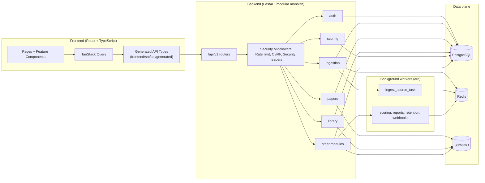

# PaperScraper v2.0 - Technische Architektur

## 1. Zielbild v2.0
PaperScraper v2.0 ist ein modulärer Monolith mit klaren Modulgrenzen, OpenAPI-vertragsgesteuerter Frontend-Integration, vereinheitlichter Ingestion-Control-Plane und sicherem Browser-Auth-Transport via HttpOnly-Cookies + CSRF.

Diese Datei ist die kanonische Architekturbeschreibung für Runtime, Schnittstellen und Sicherheitsmodell.

## 2. Architekturprinzipien
- Contract-first: Backend-API ist Quelle der Wahrheit, Frontend-Typen werden aus OpenAPI generiert.
- Single responsibility pro Modul: Ingestion-Lifecycle in `ingestion`, Paper-CRUD in `papers`, Auth in `auth`.
- Secure-by-default: Cookie-Session für Browser, CSRF-Schutz, Secret-Encryption, SSRF-Guards, tenant-isolierte Datenzugriffe.
- Shared infrastructure over ad-hoc integrations: zentrale Storage-, Upload- und DB-Session-Abstraktionen.
- Deterministische Migrationen: kein Datenverlust beim v2-Cutover.

## 3. Systemübersicht

## 4. Modulgrenzen v2.0

### 4.1 API Layer
- Entry point: `paper_scraper/api/main.py`
- Middleware: Security headers, rate limiting, CSRF validation for cookie-authenticated mutating requests.
- Authentication dependencies resolve either bearer token (API clients) or secure cookie (browser clients).

### 4.2 Auth-Modul
- Browser auth endpoints setzen/erneuern/löschen HttpOnly-Cookies.
- CSRF token is issued as non-HttpOnly cookie and must be mirrored in `X-CSRF-Token` for mutating requests.
- API-key auth path remains available for automation/developer use-cases.

### 4.3 Ingestion-Modul (Control Plane)
- Single authority for source run creation and run lifecycle status.
- Source ingestion routes are under `/api/v1/ingestion/sources/*`.
- Legacy ingestion endpoints under `papers` were removed.
- Worker handoff uses typed payloads and unified `ingest_source_task` pipeline path.

### 4.4 Papers-Modul
- Paper CRUD/read operations and single-paper actions (DOI ingest, pitch/summary, related entities).
- Batch source ingestion orchestration is no longer owned by `papers`.
- Dedupe logic consolidated via shared pipeline/service paths.

### 4.5 Storage/Upload Architektur
- Shared storage abstraction in `paper_scraper/core/storage.py` is used by modules.
- Upload validation and key sanitization are centralized in `paper_scraper/core/uploads.py`.
- Standardized storage key format and filename sanitization are enforced consistently.

## 5. Contract-first API & Frontend Sync
- Backend OpenAPI schema is exported from application code (`scripts/export_openapi.py`) to `openapi.json`.
- Frontend generated artifacts are under `frontend/src/api/generated/`.
- CI verifies schema/codegen freshness and fails on drift.
- Manual DTO drift is reduced by referencing generated OpenAPI schema types for critical shared contracts (roles, subscription tier, discovery run response).

## 6. Sicherheitsmodell v2.0

### 6.1 Browser Auth & CSRF
- Access/refresh tokens are transported in secure, same-site configurable HttpOnly cookies.
- Mutating cookie-auth requests require CSRF cookie/header match.
- Bearer-token requests are treated as non-browser and bypass CSRF middleware.

### 6.2 Secrets
- Model/provider secrets are stored encrypted (`enc:v1:` envelope), not reversible base64.
- Migration path upgrades legacy stored values without data loss.

### 6.3 SSRF Schutz
- Outbound URL fetch in text extraction pipeline rejects loopback/link-local/private/reserved targets.
- Redirect chains are validated and blocked when destination becomes unsafe.

### 6.4 Rate Limiting
- Rate limit keying prefers authenticated user identity; falls back to remote address.

## 7. Daten- und Jobfluss

### 7.1 Ingestion flow
1. Frontend triggers `/api/v1/ingestion/sources/{source}/runs`.
2. Ingestion module creates queued run and persists run state.
3. Unified worker consumes typed payload and executes `IngestionPipeline`.
4. Run transitions: `queued -> running -> completed | completed_with_errors | failed`.
5. Run status API in ingestion module serves as single status source.

### 7.2 Upload flow
1. Endpoint validates MIME + magic bytes via shared upload helpers.
2. Sanitized storage key is generated.
3. Blob is persisted through shared storage abstraction.
4. Metadata references are written in transactional DB context.

## 8. Frontend Architektur v2.0
- Central route registry in `frontend/src/config/routes.ts` is the single source for:
  - router wiring in `App.tsx`
  - command palette route items
  - keyboard navigation shortcuts
  - prefetch route loading
- Query key normalization has started via `frontend/src/config/queryKeys.ts` (typed key tuples).
- Auth context no longer persists bearer tokens in localStorage; cookie session is canonical.

## 9. Betriebsmodell
- Deployment model remains backend + workers + frontend.
- Big-bang v2 cutover is executed with planned maintenance window.
- Backup, migration, smoke and integrity checks are mandatory before opening traffic.

## 10. Zugehörige Dokumente
- Architekturentscheidungen: `04_ARCHITECTURE_DECISIONS.md`
- Umsetzungs- und Cutover-Runbook: `05_IMPLEMENTATION_PLAN.md`
- Dokumentationsindex: `docs/INDEX.md`
