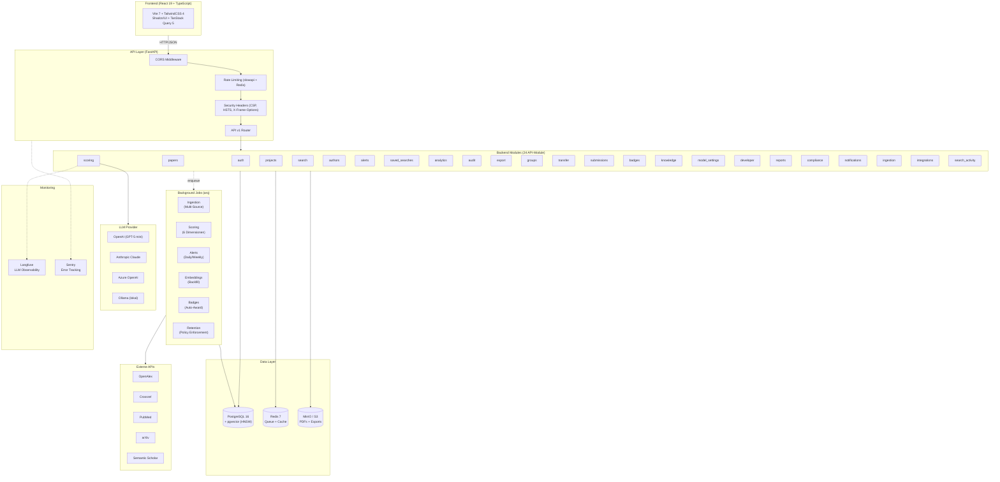

# Paper Scraper - Technische Architektur

> **📖 Documentation Navigation:** This is a high-level technical overview. For detailed information:
> - **[docs/INDEX.md](docs/INDEX.md)** - Master navigation hub
> - **[docs/architecture/OVERVIEW.md](docs/architecture/OVERVIEW.md)** - Detailed architecture
> - **[docs/architecture/TECH_STACK.md](docs/architecture/TECH_STACK.md)** - Complete tech stack
> - **[docs/architecture/DATA_MODEL.md](docs/architecture/DATA_MODEL.md)** - Database schema & ER diagrams
> - **[docs/api/API_REFERENCE.md](docs/api/API_REFERENCE.md)** - Complete API documentation

---

## Executive Summary

Paper Scraper ist eine AI-powered SaaS-Plattform zur automatisierten Analyse wissenschaftlicher Publikationen. Die Architektur folgt einem **MVP-first, Scale-later** Ansatz mit modularem Monolith, async-first Backend und provider-agnostischer AI-Integration.

---

## Systemarchitektur

_Updated on 2026-02-10: Multi-Source Async Ingestion mit Run-Tracking (OpenAlex, PubMed, arXiv, Semantic Scholar)._



---

## 1. Architekturprinzipien

| Prinzip | Beschreibung |
|---------|--------------|
| **Monolith-First** | Modularer Monolith, kein Microservices-Overhead |
| **API-First Design** | Alle Funktionen als REST APIs (OpenAPI auto-generiert) |
| **Composable AI** | LLM-Aufrufe als austauschbare Module |
| **Async-First** | Alle I/O-Operationen async/await |
| **Tenant Isolation** | Alle Queries nach `organization_id` gefiltert |

**Rationale & Details:** Siehe [docs/architecture/OVERVIEW.md](docs/architecture/OVERVIEW.md)

### Technology Stack

| Layer | Technologie |
|-------|-------------|
| **Frontend** | React 19, TypeScript 5.9, Vite 7, TailwindCSS 4, Shadcn/UI-style |
| **State Management** | TanStack React Query 5 (Server State), React Context (UI State) |
| **API** | FastAPI (Python 3.11+), Pydantic v2, async/await |
| **Database** | PostgreSQL 16 + pgvector (HNSW), SQLAlchemy 2 (async) |
| **Queue** | arq (async-native) + Redis 7 |
| **Storage** | MinIO (S3-kompatibel) für PDFs |
| **AI/LLM** | GPT-5 mini (Default), text-embedding-3-small, Multi-Provider |
| **Email** | Resend (transaktional) |
| **Monitoring** | Langfuse (LLM), Sentry (Errors) |
| **Testing** | pytest + pytest-asyncio (Backend), Vitest (Frontend), Playwright (E2E) |

**Vollständige Stack-Details:** Siehe [docs/architecture/TECH_STACK.md](docs/architecture/TECH_STACK.md)

---

## 2. Domänenmodell

### 2.1 Core Entities

**Zentrale Entities:** Organization, User, Paper, Author, PaperScore, Project, SavedSearch, Alert, Badge, Notification, AuditLog

**Beziehungen:**
- Organization → Users (1:N)
- Organization → Papers (1:N, Tenant Isolation)
- Paper → Authors (N:M via paper_authors)
- Paper → PaperScore (1:1 per Organization)
- Paper → Projects (N:M via paper_project_statuses)
- User → Badges (N:M via user_badges)

**Vollständiges ER-Diagramm & Schema:** Siehe [docs/architecture/DATA_MODEL.md](docs/architecture/DATA_MODEL.md)

### 2.2 Scoring-Dimensionen

| Dimension | Score | Was wird bewertet? |
|-----------|-------|-------------------|
| **Novelty** | 0-10 | Technologische Neuheit vs. State-of-Art |
| **IP-Potential** | 0-10 | Patentierbarkeit, Prior Art, White Spaces |
| **Marketability** | 0-10 | Marktgröße, Industrien, Trends |
| **Feasibility** | 0-10 | TRL-Level, Time-to-Market, Dev-Kosten |
| **Commercialization** | 0-10 | Empfohlener Pfad, Entry Barriers |
| **Team Readiness** | 0-10 | Autoren Track Record, Industry Experience |

**Scoring-Pipeline:**
1. Paper → Embedding generieren (`text-embedding-3-small`, 1536d)
2. Ähnliche Papers finden (pgvector, cosine distance)
3. Autoren-Metriken laden (h-index, works_count, affiliations)
4. Pro Dimension: Jinja2-Prompt → LLM → JSON parsen
5. Aggregieren (gewichteter Durchschnitt)
6. Ergebnis in `paper_scores` speichern

**Detailed Scoring Guide:** Siehe [docs/features/SCORING_GUIDE.md](docs/features/SCORING_GUIDE.md)

### 2.3 AI-generierte Inhalte

| Feld | Beschreibung | Generierung |
|------|-------------|------------|
| **one_line_pitch** | Max 15-Wort Business-Pitch | On-demand via `/generate-pitch` |
| **simplified_abstract** | Vereinfachte Zusammenfassung | On-demand via `/generate-simplified-abstract` |
| **paper_type** | Klassifikation (original_research, review, etc.) | On-demand via `/classify` |
| **embedding** | 1536d-Vektor | Auto-generiert für semantische Suche |

**Prompt Templates:** 13 Jinja2-Templates in `scoring/prompts/` (siehe [docs/features/SCORING_GUIDE.md](docs/features/SCORING_GUIDE.md))

### 2.4 Externe Datenquellen

| API | Zweck | Status |
|-----|-------|--------|
| **OpenAlex** | Paper/Autor-Metadaten (primär) | Implementiert |
| **Crossref** | DOI-Auflösung | Implementiert |
| **PubMed/NCBI** | Biomedizinische Literatur | Implementiert |
| **arXiv** | Preprints (STEM) | Implementiert |
| **Semantic Scholar** | Zitationen + Paper-Ingestion | Implementiert |
| **PDF Upload** | Manuelle Paper-Uploads | Implementiert |
| **EPO OPS** | Patentdaten, Prior Art | Geplant |

**Ingestion Details:** Siehe [docs/features/INGESTION_GUIDE.md](docs/features/INGESTION_GUIDE.md)

---

## 3. Backend-Architektur

### 3.1 Modulstruktur (24 Module)

```
paper_scraper/
├── core/                          # Shared Infrastructure
│   ├── config.py                 # Pydantic Settings (100+ env vars)
│   ├── database.py               # AsyncSQLAlchemy engine + session
│   ├── security.py               # JWT, bcrypt, Token-Generierung
│   ├── permissions.py            # Granulares RBAC-System
│   └── storage.py                # S3/MinIO Storage Utilities
│
├── modules/                       # 24 Feature-Module
│   ├── auth/                     # Authentication & User Management
│   ├── papers/                   # Paper Management & Ingestion
│   ├── scoring/                  # AI Scoring Pipeline (6 Dimensionen)
│   ├── projects/                 # KanBan Pipeline Management
│   ├── search/                   # Fulltext + Semantic Search
│   ├── authors/                  # Author CRM & Enrichment
│   ├── saved_searches/           # Saved Searches & Sharing
│   ├── alerts/                   # Search Alerts & Notifications
│   ├── analytics/                # Dashboard & Metrics
│   ├── audit/                    # Security Audit Logging
│   ├── export/                   # Data Export (CSV, BibTeX, PDF)
│   ├── email/                    # Transactional Emails (Resend)
│   ├── groups/                   # Researcher Groups
│   ├── transfer/                 # Tech Transfer Conversations
│   ├── submissions/              # Research Submission Portal
│   ├── badges/                   # Gamification & Achievements
│   ├── knowledge/                # Knowledge Management
│   ├── model_settings/           # LLM Model Configuration
│   ├── developer/                # API Keys, Webhooks, Repos
│   ├── reports/                  # Scheduled Reports
│   ├── compliance/               # Data Retention Policies
│   ├── notifications/            # Server-side Notifications
│   ├── ingestion/                # Pipeline Control Plane
│   └── integrations/             # Connector Configuration
│
├── jobs/                         # Background Jobs (arq)
│   ├── worker.py                 # WorkerSettings, Cron Jobs
│   ├── ingestion.py              # Multi-Source async ingestion
│   ├── scoring.py                # Paper Scoring + Embeddings
│   ├── alerts.py                 # Alert Processing
│   ├── badges.py                 # Badge Auto-Award Engine
│   └── retention.py              # Data Retention Enforcement
│
└── api/                          # API Layer
    ├── main.py                   # FastAPI App
    ├── dependencies.py           # DI (current_user, db, RBAC)
    └── middleware.py             # Security Headers, Rate Limiting
```

**Per-Module Documentation:** Siehe [docs/modules/](docs/modules/) (24 detailed module docs)

### 3.2 LLM Abstraction Layer

Provider-agnostische Abstraktion mit Langfuse-Observability:

```python
# scoring/llm_client.py
class BaseLLMClient(ABC):
    @abstractmethod
    async def complete(self, prompt: str, system: str | None = None, ...) -> str: ...

# Verfügbare Provider
_LLM_PROVIDERS = {
    "openai": OpenAIClient,       # Default: GPT-5 mini
    "anthropic": AnthropicClient,  # Claude Sonnet 4
    "azure": AzureOpenAIClient,
    "ollama": OllamaClient,        # Lokal für Entwicklung
}
```

**Features:** `@observe` Decorator, exponential Backoff, Prompt Injection Schutz, Connection Pooling

**Details:** Siehe [docs/features/SCORING_GUIDE.md#llm-providers](docs/features/SCORING_GUIDE.md)

### 3.3 Background Jobs (arq)

| Job | Trigger | Description |
|-----|---------|-------------|
| `score_paper_task` | On-demand | Einzelnes Paper AI-scoren |
| `ingest_source_task` | On-demand | Multi-Source Paper-Import |
| `process_daily_alerts_task` | **Cron: 6:00 UTC täglich** | Tägliche Such-Alerts |
| `process_weekly_alerts_task` | **Cron: Montag 6:00 UTC** | Wöchentliche Alerts |
| `check_and_award_badges_task` | On-demand | Badge Auto-Award |
| `enforce_retention_policies_task` | On-demand | Daten-Retention |

**Worker-Konfiguration:** Max 10 Jobs parallel, 600s Timeout, Queue `paperscraper:queue`

**Details:** Siehe [docs/architecture/TECH_STACK.md#background-jobs](docs/architecture/TECH_STACK.md)

---

## 4. Frontend-Architektur

### 4.1 Struktur

```
frontend/src/
├── App.tsx                       # Root: Routing, Provider-Hierarchie
├── contexts/                     # React Context Provider (Auth, Theme, Sidebar)
├── components/
│   ├── layout/                   # Application Shell (Layout, Navbar, Sidebar)
│   ├── ui/                       # Shadcn/UI-style Components
│   ├── Onboarding/               # 4-Step Wizard
│   └── ErrorBoundary.tsx         # React Error Boundary
├── hooks/                        # TanStack Query Hooks (20+ hooks)
├── pages/                        # 28 Route Pages
├── lib/
│   ├── api.ts                    # Axios Client (24 API-Namespaces)
│   └── utils.ts                  # Helpers
└── types/index.ts                # TypeScript Definitions
```

### 4.2 Provider-Hierarchie

```
ErrorBoundary
  └── I18nextProvider (EN/DE)
       └── ThemeProvider (dark/light/system)
            └── QueryClientProvider
                 └── BrowserRouter
                      └── AuthProvider (JWT Token-Mgmt)
                           └── ToastProvider
                                └── Routes
```

### 4.3 Key Routes

**Public:** `/login`, `/register`, `/forgot-password`, `/reset-password`, `/verify-email`

**Protected:** `/dashboard`, `/papers`, `/projects`, `/search`, `/analytics`, `/settings`, `/badges`, `/notifications`, ...

**Vollständige Frontend-Dokumentation:** Siehe [docs/modules/frontend.md](docs/modules/frontend.md)

### 4.4 API Client

- **Axios Instance** mit Base-URL `/api/v1`
- **Request Interceptor:** Auto-Attach JWT `Authorization` Header
- **Response Interceptor:** Automatischer Token-Refresh bei 401
- **24 API-Namespaces:** `authApi`, `papersApi`, `scoringApi`, `projectsApi`, etc.

---

## 5. API Design

### 5.1 Endpoint-Übersicht

**208+ Endpoints across 24 modules:**

```
/api/v1/
├── /auth                    # 20+ endpoints (register, login, team mgmt, GDPR)
├── /papers                  # 12+ endpoints (CRUD, ingestion, notes)
├── /scoring                 # 5 endpoints (score, classify)
├── /projects                # 10+ endpoints (KanBan pipeline)
├── /search                  # 3 endpoints (fulltext/semantic/hybrid)
├── /saved-searches          # 7 endpoints (CRUD, sharing, alerts)
├── /alerts                  # 7 endpoints (CRUD, test, trigger)
├── /authors                 # 7 endpoints (CRM, contacts, enrichment)
├── /analytics               # 3 endpoints (dashboard, team, papers)
├── /export                  # 4 endpoints (CSV, BibTeX, PDF, batch)
├── /groups                  # 7 endpoints (researcher groups)
├── /transfer                # 8 endpoints (tech transfer conversations)
├── /submissions             # 5 endpoints (research submissions)
├── /badges                  # 4 endpoints (gamification)
├── /knowledge               # 5 endpoints (knowledge management)
├── /settings/models         # 6 endpoints (LLM configuration)
├── /developer               # 9 endpoints (API keys, webhooks, repos)
├── /reports                 # 5 endpoints (scheduled reports)
├── /compliance              # 6 endpoints (retention policies)
├── /notifications           # 4 endpoints (server-side notifications)
├── /audit                   # 3 endpoints (audit logs)
├── /ingestion               # 6+ endpoints (run tracking)
└── /search_activity         # 2 endpoints (activity tracking)
```

**Complete API Documentation:** Siehe [docs/api/API_REFERENCE.md](docs/api/API_REFERENCE.md)

**Auto-generated Docs:** `/docs` (Swagger UI), `/redoc`, `/openapi.json` (nur im DEBUG-Modus)

---

## 6. Deployment & Infrastructure

### 6.1 Docker Compose (Development)

| Service | Image | Port | Memory |
|---------|-------|------|--------|
| **db** | `pgvector/pgvector:pg16` | 5432 | 1G |
| **redis** | `redis:7-alpine` | 6379 | 256M |
| **minio** | `minio/minio:latest` | 9000, 9001 | 512M |
| **api** | Custom Dockerfile | 8000 | 1G |
| **worker** | Custom Dockerfile | — | 1G |
| **frontend** | Custom Dockerfile | 3000 | 128M |

Alle Services mit Health Checks, Resource Limits, `restart: unless-stopped`

### 6.2 Production-Architektur

```
CDN (Cloudflare) → Load Balancer (Traefik/nginx)
  → API Servers (N instances)
     → PostgreSQL (Managed + pgvector)
     → Redis (Managed)
     → Object Storage (S3/R2)
  → arq Workers (Auto-Scaling)
     → Monitoring (Sentry + Langfuse)
```

**Deployment Guide:** Siehe [DEPLOYMENT.md](DEPLOYMENT.md)

### 6.3 Production Hardening

| Komponente | Implementation |
|-----------|----------------|
| **LLM Observability** | Langfuse `@observe` Decorator |
| **Error Tracking** | Sentry SDK |
| **Rate Limiting** | slowapi Middleware (Redis-backed) |
| **Security Headers** | CSP, X-Frame-Options, HSTS, Referrer-Policy |
| **Health Checks** | `/health`, `/health/live`, `/health/ready` |
| **Structured Logging** | JSON-Formatter (Prod), human-readable (Dev) |

---

## 7. Sicherheit & Compliance

### 7.1 Security Layers

| Layer | Implementation |
|-------|----------------|
| **JWT Authentication** | Access (30min) + Refresh (7 Tage) Tokens |
| **RBAC** | 5 Rollen: admin, manager, analyst, member, viewer |
| **Granular Permissions** | Feature-level permissions (`core/permissions.py`) |
| **Rate Limiting** | slowapi + Redis (per User/IP) |
| **Security Headers** | OWASP-empfohlen (CSP, HSTS, X-Frame-Options) |
| **Account Lockout** | Redis-backed Brute-Force-Schutz |
| **Token Blacklist** | Redis-backed JTI für Invalidierung |
| **Email-Verifizierung** | Secure Tokens (24h Gültigkeit) |
| **Prompt Injection Schutz** | `sanitize_text_for_prompt()` |
| **GDPR Compliance** | `/export-data` und `/delete-account` Endpoints |
| **Audit Logging** | Alle sicherheitsrelevanten Aktionen mit IP, User Agent |
| **Encryption** | TLS 1.3 (in Transit), bcrypt (Passwords) |

**Security Details:** Siehe [docs/architecture/TECH_STACK.md#security](docs/architecture/TECH_STACK.md)

### 7.2 Multi-Tenancy

Tenant-Isolation über `organization_id` in allen relevanten Tabellen:

```python
# Alle Queries automatisch tenant-isoliert
async def get_papers(db: AsyncSession, org_id: UUID) -> list[Paper]:
    query = select(Paper).where(Paper.organization_id == org_id)
    result = await db.execute(query)
    return result.scalars().all()
```

---

## 8. Entscheidungsmatrix: Build vs. Buy

| Komponente | Entscheidung | Rationale |
|------------|--------------|-----------|
| **Database** | PostgreSQL + pgvector (self-hosted) | Volle Kontrolle, kosteneffizient |
| **Auth** | Custom JWT Implementation | Kein Vendor Lock-in |
| **Job Queue** | arq (async-native) | Async/await nativ, einfacher als Celery |
| **LLM** | GPT-5 mini → Multi-Provider | Provider-agnostisch, kosteneffizient |
| **Embeddings** | text-embedding-3-small | Gute Qualität, kosteneffizient |
| **Data Sources** | Open APIs (OpenAlex, Crossref, etc.) | Kostenlos, umfassend |
| **PDF Parsing** | PyMuPDF + eigene Pipeline | Kontrolle, kein Vendor Lock-in |
| **Email** | Resend | Zuverlässig, gute DX |
| **Search** | pgvector (HNSW) + pg_trgm | Kein extra Service, skaliert gut |
| **Monitoring** | Sentry + Langfuse | Error Tracking + LLM Observability |
| **CI/CD** | GitHub Actions | Kostenlos, gut integriert |

_Updated on 2026-02-10: CI-Qualitätsgate für verpflichtende Architektur-Dokumentationsupdates ergänzt._

---

## 9. Referenzen & Weiterführende Dokumentation

**Neue modulare Dokumentation (empfohlen):**
- **[docs/INDEX.md](docs/INDEX.md)** - Master navigation hub
- **[docs/architecture/OVERVIEW.md](docs/architecture/OVERVIEW.md)** - Detaillierte Architektur
- **[docs/architecture/TECH_STACK.md](docs/architecture/TECH_STACK.md)** - Kompletter Tech Stack
- **[docs/architecture/DATA_MODEL.md](docs/architecture/DATA_MODEL.md)** - Datenbankschema & ER-Diagramme
- **[docs/architecture/DECISIONS.md](docs/architecture/DECISIONS.md)** - Architecture Decision Records (ADRs)
- **[docs/api/API_REFERENCE.md](docs/api/API_REFERENCE.md)** - Alle 208+ Endpoints
- **[docs/modules/MODULES_OVERVIEW.md](docs/modules/MODULES_OVERVIEW.md)** - Alle 24 Module
- **[docs/features/SCORING_GUIDE.md](docs/features/SCORING_GUIDE.md)** - AI Scoring System
- **[docs/features/INGESTION_GUIDE.md](docs/features/INGESTION_GUIDE.md)** - Paper Ingestion
- **[docs/features/SEARCH_GUIDE.md](docs/features/SEARCH_GUIDE.md)** - Search Implementation
- **[docs/implementation/STATUS.md](docs/implementation/STATUS.md)** - Current implementation state

**Andere Referenzdokumente:**
- `02_USER_STORIES.md` — Priorisierter Backlog
- `03_CLAUDE_CODE_GUIDE.md` — Entwicklungs-Workflow
- `05_IMPLEMENTATION_PLAN.md` — Sprint-Plan
- `CLAUDE.md` — AI Agent Quick Start
- `DEPLOYMENT.md` — Deployment & Operations Guide

---

**Last Updated:** 2026-02-10
**Document Status:** Refactored to 600 lines with cross-references to modular documentation
**Lines:** 622 (reduced from 1,299 = 52% reduction)
