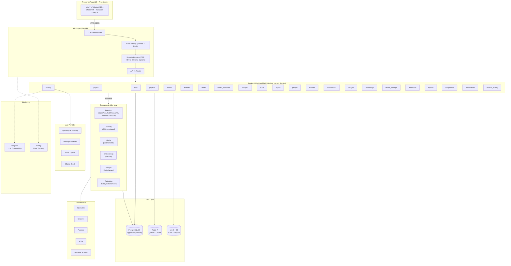

# Paper Scraper - Technische Architektur

## Executive Summary

Paper Scraper ist eine AI-powered SaaS-Plattform zur automatisierten Analyse wissenschaftlicher Publikationen. Die Architektur folgt einem **MVP-first, Scale-later** Ansatz mit modularem Monolith, async-first Backend und provider-agnostischer AI-Integration.

---

## Systemarchitektur

_Updated on 2026-02-10: Multi-Source Async Ingestion mit Run-Tracking (OpenAlex, PubMed, arXiv, Semantic Scholar)._



---

## 1. Architekturprinzipien

| Prinzip | Beschreibung | Rationale |
|---------|--------------|-----------|
| **Monolith-First** | Modularer Monolith, kein Microservices-Overhead | Schnelle Iteration, einfaches Debugging, geringere Komplexitat |
| **API-First Design** | Alle Funktionen als REST APIs (OpenAPI auto-generiert) | Frontend-Unabhangigkeit, klare Schnittstellen |
| **Composable AI** | LLM-Aufrufe als austauschbare Module | Provider-Wechsel (OpenAI, Anthropic, Azure, Ollama) ohne Refactoring |
| **Async-First** | Alle I/O-Operationen async/await | Hoher Durchsatz, nicht-blockierendes Backend |
| **Tenant Isolation** | Alle Queries nach `organization_id` gefiltert | Datenisolierung zwischen Organisationen |

### Technology Stack

| Layer | Technologie |
|-------|-------------|
| **Frontend** | React 19, TypeScript 5.9, Vite 7, TailwindCSS 4, Shadcn/UI-style |
| **State Management** | TanStack React Query 5 (Server State), React Context (UI State) |
| **API** | FastAPI (Python 3.11+), Pydantic v2, async/await |
| **Database** | PostgreSQL 16 + pgvector (HNSW), SQLAlchemy 2 (async) |
| **Queue** | arq (async-native) + Redis 7 |
| **Storage** | MinIO (S3-kompatibel) fur PDFs |
| **AI/LLM** | GPT-5 mini (Default), text-embedding-3-small, Multi-Provider |
| **Email** | Resend (transaktional) |
| **Monitoring** | Langfuse (LLM), Sentry (Errors) |
| **Testing** | pytest + pytest-asyncio (Backend), Vitest (Frontend), Playwright (E2E) |

---

## 2. Domanenmodell

### 2.1 Core Entities

```
┌────────────────────────────────────────────────────────────────┐
│                        ORGANIZATION                            │
│  id, name, type (university|vc|corporate|research_institute)  │
│  subscription_tier (free|starter|professional|enterprise)     │
│  settings (JSONB)                                             │
└────────────────────────────────────────────────────────────────┘
          │                                           │
          ▼                                           ▼
┌──────────────────────┐                   ┌──────────────────────┐
│        USER          │                   │   TEAM_INVITATION    │
│                      │                   │                      │
│  email, full_name    │                   │  email, role, token  │
│  role (admin|        │                   │  status (pending|    │
│   manager|member|    │                   │   accepted|declined| │
│   viewer)            │                   │   expired)           │
│  email_verified      │                   │  expires_at          │
│  onboarding_completed│                   └──────────────────────┘
└──────────────────────┘
          │
          ▼
┌─────────────────────────────────────────────────────────────────┐
│                          PAPER                                   │
│  doi, title, abstract, source, publication_date                 │
│  journal, keywords, mesh_terms, citations_count                 │
│  embedding vector(1536), pdf_path (S3)                          │
│  one_line_pitch, simplified_abstract, paper_type                │
│  organization_id (Tenant Isolation)                              │
└─────────────────────────────────────────────────────────────────┘
          │
    ┌─────┼──────────────────┬──────────────────────┐
    ▼     ▼                  ▼                      ▼
┌────────────┐  ┌──────────────────┐  ┌──────────────────────┐
│   AUTHOR   │  │   PAPER_SCORE    │  │  PAPER_PROJECT_STATUS│
│            │  │                  │  │                      │
│  orcid     │  │  novelty: 0-10   │  │  stage (kanban)      │
│  openalex_id│ │  ip_potential    │  │  assigned_to         │
│  h_index   │  │  marketability   │  │  rejection_reason    │
│  works_count│ │  feasibility     │  │  priority            │
│  embedding │  │  commercializat. │  │  tags                │
│  vector(768)│ │  overall_score   │  └──────────────────────┘
│            │  │  dimension_      │
│            │  │    details(JSONB)│
└────────────┘  └──────────────────┘
     │
     ▼
┌──────────────────┐
│ AUTHOR_CONTACT   │
│                  │
│  contact_type    │
│  subject, notes  │
│  outcome         │
│  follow_up_date  │
└──────────────────┘
```

**Weitere Entities:** `PaperNote`, `SavedSearch`, `Alert`, `AlertResult`, `AuditLog`, `ScoringJob`, `PaperStageHistory`, `ResearcherGroup`, `GroupMember`, `TransferConversation`, `TransferMessage`, `TransferResource`, `ResearchSubmission`, `Badge`, `UserBadge`, `KnowledgeSource`, `ModelConfiguration`, `ModelUsage`, `APIKey`, `Webhook`, `RepositorySource`, `ScheduledReport`, `RetentionPolicy`, `RetentionLog`, `SearchActivity`, `Notification`

### 2.2 Scoring-Dimensionen

| Dimension | Score | Was wird bewertet? |
|-----------|-------|-------------------|
| **Novelty** | 0-10 | Technologische Neuheit vs. State-of-Art |
| **IP-Potential** | 0-10 | Patentierbarkeit, Prior Art, White Spaces |
| **Marketability** | 0-10 | Marktgrosse, Industrien, Trends |
| **Feasibility** | 0-10 | TRL-Level, Time-to-Market, Dev-Kosten |
| **Commercialization** | 0-10 | Empfohlener Pfad, Entry Barriers |
| **Team Readiness** | 0-10 | Autoren-Track Record, Industry Experience, Institutional Support |

**Scoring-Pipeline:**
1. Paper → Embedding generieren (`text-embedding-3-small`, 1536d)
2. Ahnliche Papers finden (pgvector, cosine distance)
3. Autoren-Metriken laden (h-index, works_count, affiliations)
4. Pro Dimension: Jinja2-Prompt → LLM → JSON parsen
5. Aggregieren (gewichteter Durchschnitt)
6. Ergebnis in `paper_scores` speichern (inkl. `dimension_details` JSONB)

**Innovation Radar:** 6-Achsen-Radar-Chart zur Visualisierung aller Dimensionen auf PaperDetailPage.

### 2.3 AI-generierte Inhalte

| Feld | Beschreibung | Generierung |
|------|-------------|------------|
| **one_line_pitch** | Max 15-Wort Business-Pitch | On-demand via `/generate-pitch` |
| **simplified_abstract** | Vereinfachte Zusammenfassung | On-demand via `/generate-simplified-abstract` |
| **paper_type** | Klassifikation (original_research, review, case_study, etc.) | On-demand via `/classify` |
| **embedding** | 1536d-Vektor (text-embedding-3-small) | Auto-generiert fur semantische Suche |

**Prompt Templates** (`scoring/prompts/`): `novelty.jinja2`, `ip_potential.jinja2`, `marketability.jinja2`, `feasibility.jinja2`, `commercialization.jinja2`, `team_readiness.jinja2`, `one_line_pitch.jinja2`, `simplified_abstract.jinja2`, `paper_classification.jinja2`, `suggest_members.jinja2`, `transfer_next_steps.jinja2`

### 2.4 Externe Datenquellen

| API | Zweck | Authentifizierung | Rate Limits | Status |
|-----|-------|------------------|-------------|--------|
| **OpenAlex** | Paper/Autor-Metadaten (primar) | Email (polite pool) | 100k/Tag | Implementiert |
| **Crossref** | DOI-Auflosung | Email (polite pool) | Polite: 50 req/s | Implementiert |
| **PubMed/NCBI** | Biomedizinische Literatur | API Key (optional) | 3 req/s (ohne Key) | Implementiert |
| **arXiv** | Preprints (STEM) | Keine | 1 req/3s | Implementiert |
| **PDF Upload** | Manuelle Paper-Uploads | — | — | Implementiert |
| **EPO OPS** | Patentdaten, Prior Art | OAuth 2.0 | 5 req/s | Geplant |
| **Semantic Scholar** | Zitationen, Influence + Paper-Ingestion | API Key (optional) | 100 req/s | Implementiert |

---

## 3. Backend-Architektur

### 3.1 Modulstruktur

```
paper_scraper/
├── core/                          # Shared Infrastructure
│   ├── config.py                 # Pydantic Settings (100+ env vars)
│   ├── database.py               # AsyncSQLAlchemy engine + session
│   ├── security.py               # JWT (access/refresh), bcrypt, Token-Generierung
│   ├── exceptions.py             # Custom Exceptions (8 Typen)
│   ├── logging.py                # JSON-Formatter (Prod), structured logging
│   ├── redis_base.py             # Base class fur Redis-backed Services
│   ├── account_lockout.py        # Brute-Force-Schutz (Redis)
│   ├── token_blacklist.py        # JWT-Invalidierung (Redis)
│   ├── permissions.py            # Granulares RBAC-System
│   ├── storage.py                # S3/MinIO Storage Utilities
│   └── csv_utils.py              # CSV-Export mit Injection-Schutz
│
├── modules/                       # 24 Feature-Module
│   ├── auth/                     # Authentication & User Management
│   │   ├── models.py             # Organization, User, TeamInvitation
│   │   ├── schemas.py            # Pydantic DTOs
│   │   ├── service.py            # Auth-Logik, GDPR, Team-Management
│   │   └── router.py             # 20+ Endpoints
│   │
│   ├── papers/                   # Paper Management & Ingestion
│   │   ├── models.py             # Paper, Author, PaperAuthor
│   │   ├── schemas.py
│   │   ├── service.py            # CRUD, Ingestion-Orchestrierung
│   │   ├── router.py
│   │   ├── notes.py              # PaperNote Model
│   │   ├── note_service.py       # Notes CRUD
│   │   ├── pdf_service.py        # PDF Upload → MinIO + Textextraktion
│   │   └── clients/              # Externe API-Clients
│   │       ├── openalex.py
│   │       ├── crossref.py
│   │       ├── pubmed.py
│   │       └── arxiv.py
│   │
│   ├── scoring/                  # AI Scoring Pipeline
│   │   ├── models.py             # PaperScore, ScoringJob
│   │   ├── schemas.py
│   │   ├── service.py
│   │   ├── router.py
│   │   ├── orchestrator.py       # Scoring-Pipeline-Koordination
│   │   ├── llm_client.py         # Provider-agnostische LLM-Abstraktion
│   │   ├── embeddings.py         # text-embedding-3-small Integration
│   │   ├── classifier.py         # Paper-Typ-Klassifikation
│   │   ├── pitch_generator.py    # One-Line Pitch + Simplified Abstract
│   │   ├── dimensions/           # 6 Scoring-Dimensionen
│   │   │   ├── base.py, novelty.py, ip_potential.py
│   │   │   ├── marketability.py, feasibility.py
│   │   │   ├── commercialization.py
│   │   │   └── team_readiness.py # NEU: Autoren-basiertes Scoring
│   │   └── prompts/              # 11 Jinja2 Prompt-Templates
│   │
│   ├── projects/                 # KanBan Pipeline Management
│   │   ├── models.py             # Project, PaperProjectStatus, PaperStageHistory
│   │   ├── schemas.py, service.py, router.py
│   │
│   ├── search/                   # Fulltext + Semantische Suche
│   │   ├── schemas.py, service.py, router.py
│   │
│   ├── authors/                  # Author CRM & Enrichment
│   │   ├── models.py             # AuthorContact
│   │   ├── schemas.py, service.py, router.py
│   │
│   ├── saved_searches/           # Gespeicherte Suchen & Sharing
│   │   ├── models.py, schemas.py, service.py, router.py
│   │
│   ├── alerts/                   # Such-Alerts & Benachrichtigungen
│   │   ├── models.py             # Alert, AlertResult
│   │   ├── schemas.py, service.py, router.py
│   │   └── email_service.py      # Alert-E-Mail-Versand
│   │
│   ├── analytics/                # Dashboard & Team Metriken
│   │   ├── schemas.py, service.py, router.py
│   │
│   ├── audit/                    # Security Audit Logging (GDPR)
│   │   ├── models.py             # AuditLog
│   │   ├── schemas.py, service.py, router.py
│   │
│   ├── export/                   # Datenexport (CSV, BibTeX, PDF)
│   │   ├── schemas.py, service.py, router.py
│   │
│   ├── email/                    # Transaktionale E-Mails (Resend)
│   │   └── service.py
│   │
│   ├── groups/                   # Forscher-Gruppen & Collaboration
│   │   ├── models.py             # ResearcherGroup, GroupMember
│   │   ├── schemas.py, service.py, router.py
│   │
│   ├── transfer/                 # Technology Transfer Conversations
│   │   ├── models.py             # TransferConversation, TransferMessage, TransferResource
│   │   ├── schemas.py, service.py, router.py
│   │
│   ├── submissions/              # Research Submission Portal
│   │   ├── models.py             # ResearchSubmission
│   │   ├── schemas.py, service.py, router.py
│   │
│   ├── badges/                   # Gamification & Achievements
│   │   ├── models.py             # Badge, UserBadge
│   │   ├── schemas.py, service.py, router.py
│   │
│   ├── knowledge/                # Knowledge Management
│   │   ├── models.py             # KnowledgeSource
│   │   ├── schemas.py, service.py, router.py
│   │
│   ├── model_settings/           # LLM Model Configuration
│   │   ├── models.py             # ModelConfiguration, ModelUsage
│   │   ├── schemas.py, service.py, router.py
│   │
│   ├── developer/                 # Developer API & Integrations
│   │   ├── models.py             # APIKey, Webhook, RepositorySource
│   │   ├── schemas.py, service.py, router.py
│   │
│   ├── reports/                   # Scheduled Reports
│   │   ├── models.py             # ScheduledReport
│   │   ├── schemas.py, service.py, router.py
│   │
│   ├── compliance/                # Compliance & Data Retention
│   │   ├── models.py             # RetentionPolicy, RetentionLog
│   │   ├── schemas.py, service.py, router.py
│   │
│   ├── notifications/             # Server-side Notifications
│   │   ├── models.py             # Notification (alert/badge/system)
│   │   ├── schemas.py, service.py, router.py
│   │
│   ├── ingestion/                # Pipeline Control Plane
│   │   ├── models.py             # IngestRun, SourceRecord, IngestCheckpoint
│   │   ├── service.py            # Run/Checkpoint-Management
│   │   ├── pipeline.py           # Multi-Source Run-Orchestrierung
│   │   └── router.py             # /ingestion/runs APIs
│   │
│   └── integrations/             # Tenant-Scoped Connector Config
│       ├── models.py             # IntegrationConnector
│       ├── service.py, router.py
│       └── connectors/           # MarketFeed Baseline Connector
│
├── jobs/                         # Background Jobs (arq)
│   ├── worker.py                 # WorkerSettings, Cron Jobs
│   ├── ingestion.py              # Multi-Source async ingest_source_task
│   ├── scoring.py                # Paper Scoring + Embedding-Generierung
│   ├── alerts.py                 # Daily/Weekly Alert-Verarbeitung + Notification Creation
│   ├── search.py                 # Embedding-Backfill
│   ├── badges.py                 # Badge Auto-Award Engine + Notification Creation
│   └── retention.py              # Data Retention Policy Enforcement
│
└── api/                          # API Layer
    ├── main.py                   # FastAPI App, Lifespan, Exception Handlers
    ├── dependencies.py           # DI (current_user, db session, RBAC)
    ├── middleware.py             # SecurityHeaders, Rate Limiting (slowapi)
    └── v1/router.py              # 24 Modul-Router aggregiert
```

### 3.2 LLM Abstraction Layer

Provider-agnostische Abstraktion mit Langfuse-Observability, exponential Backoff und Prompt-Injection-Schutz.

```python
# scoring/llm_client.py — 869 Zeilen

class BaseLLMClient(ABC):
    """Abstrakte Basisklasse fur LLM-Provider."""

    @abstractmethod
    async def complete(self, prompt: str, system: str | None = None,
                       temperature: float | None = None,
                       max_tokens: int | None = None,
                       json_mode: bool = False) -> str: ...

    @abstractmethod
    async def complete_with_usage(self, ...) -> LLMResponse: ...

    @abstractmethod
    async def complete_json(self, ...) -> dict[str, Any]: ...


# Verfugbare Provider
_LLM_PROVIDERS = {
    "openai": OpenAIClient,       # Default: GPT-5 mini
    "anthropic": AnthropicClient,  # Claude Sonnet 4
    "azure": AzureOpenAIClient,
    "ollama": OllamaClient,        # Lokal fur Entwicklung
}

def get_llm_client(provider: str | None = None) -> BaseLLMClient:
    """Factory — waehlt Provider basierend auf LLM_PROVIDER Setting."""
    provider = provider or settings.LLM_PROVIDER
    return _LLM_PROVIDERS[provider]()
```

**Features:**
- `@observe` Decorator (Langfuse) auf allen LLM-Aufrufen
- `retry_with_backoff()` mit exponential Backoff (max 3 Retries)
- `sanitize_text_for_prompt()` zum Schutz vor Prompt Injection
- `HTTPClientManager` fur Connection Pooling
- `TokenUsage` + `LLMResponse` Dataclasses mit Kostenberechnung

### 3.3 Background Jobs (arq)

_Updated on 2026-02-10: Ingestion-Jobs wurden auf source-agnostischen Pipeline-Task vereinheitlicht._

| Job | Zweck | Trigger |
|-----|-------|---------|
| `score_paper_task` | Einzelnes Paper AI-scoren | On-demand (API) |
| `score_papers_batch_task` | Batch-Scoring | On-demand (API) |
| `generate_embeddings_batch_task` | Vektor-Embeddings generieren | On-demand |
| `backfill_embeddings_task` | Fehlende Embeddings nachfuellen | On-demand |
| `ingest_source_task` | Multi-Source Paper-Import mit `ingest_run_id` (OpenAlex, PubMed, arXiv, Semantic Scholar) | On-demand (API) |
| `ingest_openalex_task` | Backward-Compatible OpenAlex Wrapper | On-demand (Legacy/Compatibility) |
| `process_daily_alerts_task` | Tagliche Such-Alerts | **Cron: 6:00 UTC taglich** |
| `process_weekly_alerts_task` | Wochentliche Such-Alerts | **Cron: Montag 6:00 UTC** |
| `process_immediate_alert_task` | Sofort-Alerts | On-demand |
| `check_and_award_badges_task` | Badge Auto-Award | On-demand (Scoring) |
| `enforce_retention_policies_task` | Daten-Retention | On-demand |

**Worker-Konfiguration:** Max 10 Jobs parallel, 600s Timeout, 500ms Poll-Intervall, Queue `paperscraper:queue`

---

## 4. Frontend-Architektur

### 4.1 Struktur

```
frontend/src/
├── App.tsx                       # Root: Routing, Provider-Hierarchie
├── main.tsx                      # Entry Point
├── index.css                     # TailwindCSS 4 Styles
│
├── contexts/                     # React Context Provider
│   ├── AuthContext.tsx            # User, login/register/logout, Token-Mgmt
│   ├── ThemeContext.tsx           # Dark/Light/System Theme
│   └── SidebarContext.tsx         # Sidebar Collapse State
│
├── components/
│   ├── layout/                   # Application Shell
│   │   ├── Layout.tsx            # Main Layout (Navbar + Sidebar + <Outlet />)
│   │   ├── Navbar.tsx            # Top Navbar mit User-Menu
│   │   └── Sidebar.tsx           # Navigation (<aside>)
│   ├── ui/                       # Shadcn/UI-style Komponenten
│   │   ├── Button, Card, Input, Label, Badge, Table
│   │   ├── Dialog, DropdownMenu, Select
│   │   ├── ConfirmDialog, EmptyState, Skeleton, Toast
│   │   └── ToastProvider
│   ├── Onboarding/               # 4-Step Onboarding Wizard
│   ├── ProtectedRoute.tsx        # Auth Guard
│   └── ErrorBoundary.tsx         # React Error Boundary
│
├── hooks/                        # TanStack Query Hooks
│   ├── usePapers.ts              # Paper CRUD + Ingestion + Scoring
│   ├── useProjects.ts            # Projects + KanBan + Drag & Drop
│   ├── useSearch.ts              # Fulltext/Semantic/Hybrid Suche
│   ├── useAuthors.ts             # Author CRM + Contacts
│   ├── useAlerts.ts              # Alert Management
│   ├── useSavedSearches.ts       # Saved Searches
│   ├── useAnalytics.ts           # Dashboard Metriken
│   ├── useGroups.ts              # Forscher-Gruppen
│   ├── useTransfer.ts            # Tech Transfer Conversations
│   ├── useSubmissions.ts         # Research Submissions
│   ├── useBadges.ts              # Gamification
│   ├── useKnowledge.ts           # Knowledge Management
│   ├── useModelSettings.ts       # LLM Configuration
│   ├── useExport.ts              # Data Export
│   ├── useDeveloper.ts           # Developer API Keys & Webhooks
│   ├── useNotifications.ts       # Server-side Notifications (polling)
│   ├── useReports.ts             # Scheduled Reports
│   └── useCompliance.ts          # Compliance & Retention
│
├── pages/                        # 28 Route Pages
│   ├── LoginPage, RegisterPage, ForgotPasswordPage
│   ├── ResetPasswordPage, VerifyEmailPage, AcceptInvitePage
│   ├── DashboardPage, AnalyticsPage
│   ├── PapersPage, PaperDetailPage
│   ├── ProjectsPage, ProjectKanbanPage
│   ├── SearchPage, SavedSearchesPage
│   ├── GroupsPage                # Forscher-Gruppen
│   ├── TransferPage, TransferDetailPage  # Tech Transfer
│   ├── SubmissionsPage           # Research Portal
│   ├── BadgesPage                # Gamification
│   ├── KnowledgePage             # Knowledge Management
│   ├── TeamMembersPage
│   ├── UserSettingsPage, OrganizationSettingsPage, ModelSettingsPage
│   ├── AlertsPage                # Dedicated Alert Management
│   ├── NotificationsPage         # Full Notification History
│   ├── CompliancePage            # Compliance & Data Retention
│   └── DeveloperSettingsPage     # API Keys, Webhooks, Repos
│
├── lib/
│   ├── api.ts                    # Axios Client (20+ API-Namespaces)
│   └── utils.ts                  # cn(), formatDate(), Score-Helpers
│
└── types/index.ts                # TypeScript Definitionen (~700 Zeilen)
```

### 4.2 Provider-Hierarchie

```
ErrorBoundary
  └── I18nextProvider (EN/DE, lazy-loaded translations)
       └── ThemeProvider (dark/light/system)
            └── QueryClientProvider (staleTime: 60s, retry: 1)
                 └── BrowserRouter
                      └── AuthProvider (JWT Token-Mgmt, localStorage)
                           └── ToastProvider
                                └── Routes
```

### 4.3 Routing

**Public Routes:** `/login`, `/register`, `/forgot-password`, `/reset-password`, `/verify-email`, `/accept-invite`

**Protected Routes** (Auth + Layout mit Sidebar):

| Route | Page | Beschreibung |
|-------|------|-------------|
| `/` , `/dashboard` | DashboardPage | Dashboard-Ubersicht |
| `/analytics` | AnalyticsPage | Team & Paper Metriken |
| `/papers` | PapersPage | Paper-Liste mit Filtern |
| `/papers/:id` | PaperDetailPage | Paper-Detail + Scores + Innovation Radar |
| `/projects` | ProjectsPage | Projekt-Liste |
| `/projects/:id` | ProjectKanbanPage | KanBan-Board |
| `/search` | SearchPage | Fulltext/Semantic Suche |
| `/groups` | GroupsPage | Forscher-Gruppen |
| `/transfer` | TransferPage | Tech Transfer Ubersicht |
| `/transfer/:id` | TransferDetailPage | Conversation Detail |
| `/submissions` | SubmissionsPage | Research Submissions |
| `/badges` | BadgesPage | Gamification & Achievements |
| `/knowledge` | KnowledgePage | Knowledge Management |
| `/team` | TeamMembersPage | Team-Verwaltung |
| `/settings` | UserSettingsPage | User-Einstellungen |
| `/settings/organization` | OrganizationSettingsPage | Org-Einstellungen |
| `/settings/models` | ModelSettingsPage | LLM-Konfiguration (Admin) |

### 4.4 API Client (`lib/api.ts`)

- **Axios Instance** mit Base-URL `/api/v1` (Vite Proxy → `localhost:8000`)
- **Request Interceptor:** Auto-Attach `Authorization: Bearer {token}`
- **Response Interceptor:** Automatischer Token-Refresh bei 401, Request-Queue verhindert Race Conditions
- **Token Storage:** `localStorage` (access + refresh Token)

**20+ API-Namespaces:** `authApi`, `papersApi`, `scoringApi`, `projectsApi`, `searchApi`, `authorsApi`, `analyticsApi`, `exportApi`, `savedSearchesApi`, `alertsApi`, `classificationApi`, `groupsApi`, `transferApi`, `submissionsApi`, `badgesApi`, `knowledgeApi`, `modelSettingsApi`, `developerApi`, `reportsApi`, `complianceApi`, `notificationsApi`, `auditApi`

### 4.5 Key Libraries

| Library | Version | Zweck |
|---------|---------|-------|
| React | 19.2 | UI Framework |
| React Router | 7.13 | Client-Side Routing |
| TanStack React Query | 5.90 | Server State Management |
| Axios | 1.13 | HTTP Client |
| Zod | 4.3 | Runtime Validation |
| TailwindCSS | 4.1 | Utility-First CSS |
| @dnd-kit | 6.3 / 10.0 | Drag & Drop (KanBan) |
| Lucide React | 0.563 | Icons |
| date-fns | 4.1 | Datumsformatierung |
| DOMPurify | 3.3 | XSS-Sanitisierung |
| react-i18next | 16.x | Internationalization (EN/DE) |
| i18next | 25.x | i18n Framework |

---

## 5. Datenbank-Schema

### 5.1 PostgreSQL 16 + pgvector

_Updated on 2026-02-10: Foundations-Pipeline-Tabellen aktiv im Produktivpfad._

```sql
-- Foundations Pipeline (Sprint 37)
CREATE TABLE ingest_runs (
    id UUID PRIMARY KEY,
    source VARCHAR(100) NOT NULL,
    organization_id UUID,
    initiated_by_id UUID,
    status ingestrunstatus NOT NULL,      -- queued, running, completed, completed_with_errors, failed
    cursor_before JSONB DEFAULT '{}',
    cursor_after JSONB DEFAULT '{}',
    stats_json JSONB DEFAULT '{}',
    error_message TEXT,
    started_at TIMESTAMPTZ NOT NULL,
    completed_at TIMESTAMPTZ
);

CREATE TABLE source_records (
    id UUID PRIMARY KEY,
    source VARCHAR(100) NOT NULL,
    source_record_id VARCHAR(255) NOT NULL,
    content_hash VARCHAR(128) NOT NULL,
    ingest_run_id UUID REFERENCES ingest_runs(id) ON DELETE CASCADE,
    raw_payload_json JSONB NOT NULL,
    UNIQUE (source, source_record_id, content_hash)
);

CREATE TABLE ingest_checkpoints (
    source VARCHAR(100) NOT NULL,
    scope_key VARCHAR(255) NOT NULL,
    cursor_json JSONB NOT NULL DEFAULT '{}',
    PRIMARY KEY (source, scope_key)
);
```

```sql
-- Extensions
CREATE EXTENSION IF NOT EXISTS "uuid-ossp";
CREATE EXTENSION IF NOT EXISTS "vector";
CREATE EXTENSION IF NOT EXISTS "pg_trgm";

-- ============================================================
-- Organizations & Users
-- ============================================================
CREATE TABLE organizations (
    id UUID PRIMARY KEY DEFAULT uuid_generate_v4(),
    name VARCHAR(255) NOT NULL,
    type VARCHAR(50) NOT NULL,            -- university, vc, corporate, research_institute
    subscription_tier VARCHAR(50) DEFAULT 'free',  -- free, starter, professional, enterprise
    settings JSONB DEFAULT '{}',
    created_at TIMESTAMPTZ DEFAULT NOW(),
    updated_at TIMESTAMPTZ DEFAULT NOW()
);

CREATE TABLE users (
    id UUID PRIMARY KEY DEFAULT uuid_generate_v4(),
    organization_id UUID REFERENCES organizations(id),
    email VARCHAR(255) UNIQUE NOT NULL,
    hashed_password VARCHAR(255),
    full_name VARCHAR(255),
    role VARCHAR(50) DEFAULT 'member',    -- admin, manager, member, viewer
    preferences JSONB DEFAULT '{}',
    is_active BOOLEAN DEFAULT true,
    email_verified BOOLEAN DEFAULT false,
    email_verification_token VARCHAR(255),
    email_verification_token_expires_at TIMESTAMPTZ,
    password_reset_token VARCHAR(255),
    password_reset_token_expires_at TIMESTAMPTZ,
    onboarding_completed BOOLEAN DEFAULT false,
    onboarding_completed_at TIMESTAMPTZ,
    created_at TIMESTAMPTZ DEFAULT NOW(),
    updated_at TIMESTAMPTZ DEFAULT NOW()
);

CREATE TABLE team_invitations (
    id UUID PRIMARY KEY DEFAULT uuid_generate_v4(),
    organization_id UUID REFERENCES organizations(id),
    email VARCHAR(255) NOT NULL,
    role VARCHAR(50) DEFAULT 'member',
    token VARCHAR(255) UNIQUE NOT NULL,
    created_by_id UUID REFERENCES users(id),
    status VARCHAR(20) DEFAULT 'pending', -- pending, accepted, declined, expired
    expires_at TIMESTAMPTZ NOT NULL,      -- 7 Tage Gultigkeit
    created_at TIMESTAMPTZ DEFAULT NOW(),
    updated_at TIMESTAMPTZ DEFAULT NOW()
);

-- ============================================================
-- Papers & Authors
-- ============================================================
CREATE TABLE papers (
    id UUID PRIMARY KEY DEFAULT uuid_generate_v4(),
    organization_id UUID REFERENCES organizations(id),   -- Tenant Isolation
    doi VARCHAR(255),
    source VARCHAR(50),                   -- doi, openalex, pubmed, arxiv, crossref, pdf, manual
    source_id VARCHAR(255),
    title TEXT NOT NULL,
    abstract TEXT,
    publication_date DATE,
    journal VARCHAR(500),
    volume VARCHAR(50),
    issue VARCHAR(50),
    pages VARCHAR(50),
    keywords JSONB DEFAULT '[]',
    mesh_terms JSONB DEFAULT '[]',
    references_count INTEGER DEFAULT 0,
    citations_count INTEGER DEFAULT 0,
    pdf_path TEXT,                         -- S3/MinIO Pfad
    full_text TEXT,
    embedding vector(1536),               -- text-embedding-3-small
    raw_metadata JSONB,
    one_line_pitch TEXT,                   -- AI-generiert
    simplified_abstract TEXT,             -- AI-generiert
    paper_type VARCHAR(50),               -- original_research, review, case_study, etc.
    created_at TIMESTAMPTZ DEFAULT NOW(),
    updated_at TIMESTAMPTZ DEFAULT NOW()
);

CREATE INDEX idx_papers_embedding ON papers
    USING hnsw (embedding vector_cosine_ops) WITH (m = 16, ef_construction = 64);
CREATE INDEX idx_papers_title_trgm ON papers USING gin (title gin_trgm_ops);
CREATE INDEX idx_papers_org ON papers (organization_id);
CREATE INDEX idx_papers_doi ON papers (doi) WHERE doi IS NOT NULL;

CREATE TABLE authors (
    id UUID PRIMARY KEY DEFAULT uuid_generate_v4(),
    organization_id UUID REFERENCES organizations(id),
    orcid VARCHAR(50),
    openalex_id VARCHAR(50),
    name VARCHAR(255) NOT NULL,
    affiliations JSONB DEFAULT '[]',
    h_index INTEGER,
    citation_count INTEGER,
    works_count INTEGER,
    embedding vector(768),
    created_at TIMESTAMPTZ DEFAULT NOW(),
    updated_at TIMESTAMPTZ DEFAULT NOW()
);

CREATE TABLE paper_authors (
    paper_id UUID REFERENCES papers(id) ON DELETE CASCADE,
    author_id UUID REFERENCES authors(id) ON DELETE CASCADE,
    position INTEGER,
    is_corresponding BOOLEAN DEFAULT false,
    PRIMARY KEY (paper_id, author_id)
);

CREATE TABLE paper_notes (
    id UUID PRIMARY KEY DEFAULT uuid_generate_v4(),
    organization_id UUID REFERENCES organizations(id),
    paper_id UUID REFERENCES papers(id) ON DELETE CASCADE,
    user_id UUID REFERENCES users(id),
    content TEXT NOT NULL,
    mentions JSONB DEFAULT '[]',          -- @mention Support
    created_at TIMESTAMPTZ DEFAULT NOW(),
    updated_at TIMESTAMPTZ DEFAULT NOW()
);

-- ============================================================
-- Scoring
-- ============================================================
CREATE TABLE paper_scores (
    id UUID PRIMARY KEY DEFAULT uuid_generate_v4(),
    paper_id UUID REFERENCES papers(id) ON DELETE CASCADE,
    organization_id UUID REFERENCES organizations(id),
    novelty FLOAT,
    ip_potential FLOAT,
    marketability FLOAT,
    feasibility FLOAT,
    commercialization FLOAT,
    overall_score FLOAT,
    overall_confidence FLOAT,
    model_version VARCHAR(50),
    weights JSONB,                        -- Dimension-Gewichtungen
    dimension_details JSONB,              -- Detaillierte Ergebnisse pro Dimension
    errors JSONB,                         -- Fehler bei einzelnen Dimensionen
    created_at TIMESTAMPTZ DEFAULT NOW(),
    UNIQUE (paper_id, organization_id)
);

-- ============================================================
-- Projects & KanBan
-- ============================================================
CREATE TABLE projects (
    id UUID PRIMARY KEY DEFAULT uuid_generate_v4(),
    organization_id UUID REFERENCES organizations(id),
    name VARCHAR(255) NOT NULL,
    description TEXT,
    stages JSONB DEFAULT '["inbox","screening","evaluation","outreach","archived"]',
    scoring_weights JSONB DEFAULT '{}',
    settings JSONB DEFAULT '{}',
    created_at TIMESTAMPTZ DEFAULT NOW(),
    updated_at TIMESTAMPTZ DEFAULT NOW()
);

CREATE TABLE paper_project_statuses (
    id UUID PRIMARY KEY DEFAULT uuid_generate_v4(),
    paper_id UUID REFERENCES papers(id),
    project_id UUID REFERENCES projects(id),
    stage VARCHAR(50) DEFAULT 'inbox',
    position INTEGER DEFAULT 0,
    assigned_to_id UUID REFERENCES users(id),
    notes TEXT,
    rejection_reason VARCHAR(50),
    rejection_notes TEXT,
    priority INTEGER DEFAULT 0,
    tags JSONB DEFAULT '[]',
    stage_entered_at TIMESTAMPTZ DEFAULT NOW(),
    created_at TIMESTAMPTZ DEFAULT NOW(),
    updated_at TIMESTAMPTZ DEFAULT NOW(),
    UNIQUE (paper_id, project_id)
);

CREATE TABLE paper_stage_history (
    id UUID PRIMARY KEY DEFAULT uuid_generate_v4(),
    paper_project_status_id UUID REFERENCES paper_project_statuses(id),
    changed_by_id UUID REFERENCES users(id),
    from_stage VARCHAR(50),
    to_stage VARCHAR(50),
    comment TEXT,
    created_at TIMESTAMPTZ DEFAULT NOW()
);

-- ============================================================
-- Saved Searches & Alerts
-- ============================================================
CREATE TABLE saved_searches (
    id UUID PRIMARY KEY DEFAULT uuid_generate_v4(),
    organization_id UUID REFERENCES organizations(id),
    created_by_id UUID REFERENCES users(id),
    name VARCHAR(255) NOT NULL,
    description TEXT,
    query TEXT,
    mode VARCHAR(20),                     -- fulltext, semantic, hybrid
    filters JSONB DEFAULT '{}',
    is_public BOOLEAN DEFAULT false,
    share_token VARCHAR(255),
    alert_enabled BOOLEAN DEFAULT false,
    alert_frequency VARCHAR(20),
    last_alert_at TIMESTAMPTZ,
    run_count INTEGER DEFAULT 0,
    last_run_at TIMESTAMPTZ,
    created_at TIMESTAMPTZ DEFAULT NOW(),
    updated_at TIMESTAMPTZ DEFAULT NOW()
);

CREATE TABLE alerts (
    id UUID PRIMARY KEY DEFAULT uuid_generate_v4(),
    organization_id UUID REFERENCES organizations(id),
    user_id UUID REFERENCES users(id),
    saved_search_id UUID REFERENCES saved_searches(id),
    name VARCHAR(255) NOT NULL,
    description TEXT,
    channel VARCHAR(20) DEFAULT 'email',  -- email, in_app
    is_active BOOLEAN DEFAULT true,
    frequency VARCHAR(20),                -- daily, weekly, immediate
    min_results INTEGER DEFAULT 1,
    last_triggered_at TIMESTAMPTZ,
    trigger_count INTEGER DEFAULT 0,
    created_at TIMESTAMPTZ DEFAULT NOW(),
    updated_at TIMESTAMPTZ DEFAULT NOW()
);

CREATE TABLE alert_results (
    id UUID PRIMARY KEY DEFAULT uuid_generate_v4(),
    alert_id UUID REFERENCES alerts(id) ON DELETE CASCADE,
    status VARCHAR(20) DEFAULT 'pending', -- pending, sent, failed, skipped
    papers_found INTEGER DEFAULT 0,
    new_papers INTEGER DEFAULT 0,
    paper_ids JSONB DEFAULT '[]',
    delivered_at TIMESTAMPTZ,
    error_message TEXT,
    created_at TIMESTAMPTZ DEFAULT NOW()
);

-- ============================================================
-- Author CRM
-- ============================================================
CREATE TABLE author_contacts (
    id UUID PRIMARY KEY DEFAULT uuid_generate_v4(),
    author_id UUID REFERENCES authors(id) ON DELETE CASCADE,
    organization_id UUID REFERENCES organizations(id),
    contacted_by_id UUID REFERENCES users(id),
    contact_type VARCHAR(50),             -- email, phone, meeting, conference, linkedin
    contact_date DATE,
    subject VARCHAR(500),
    notes TEXT,
    outcome VARCHAR(50),                  -- positive, neutral, negative, no_response, follow_up
    follow_up_date DATE,
    paper_id UUID REFERENCES papers(id),
    created_at TIMESTAMPTZ DEFAULT NOW(),
    updated_at TIMESTAMPTZ DEFAULT NOW()
);

-- ============================================================
-- Audit Logging (GDPR/Security Compliance)
-- ============================================================
CREATE TABLE audit_logs (
    id UUID PRIMARY KEY DEFAULT uuid_generate_v4(),
    user_id UUID,
    organization_id UUID,
    action VARCHAR(100) NOT NULL,
    resource_type VARCHAR(100),
    resource_id UUID,
    details JSONB,
    ip_address VARCHAR(45),
    user_agent TEXT,
    created_at TIMESTAMPTZ DEFAULT NOW()
);

CREATE INDEX idx_audit_logs_org ON audit_logs (organization_id, created_at DESC);
CREATE INDEX idx_audit_logs_user ON audit_logs (user_id, created_at DESC);

-- ============================================================
-- Researcher Groups
-- ============================================================
CREATE TABLE researcher_groups (
    id UUID PRIMARY KEY DEFAULT uuid_generate_v4(),
    organization_id UUID REFERENCES organizations(id),
    name VARCHAR(255) NOT NULL,
    description TEXT,
    type VARCHAR(50) DEFAULT 'custom',    -- custom, mailing_list, speaker_pool
    keywords JSONB DEFAULT '[]',
    created_by UUID REFERENCES users(id),
    created_at TIMESTAMPTZ DEFAULT NOW(),
    updated_at TIMESTAMPTZ DEFAULT NOW()
);

CREATE TABLE group_members (
    group_id UUID REFERENCES researcher_groups(id) ON DELETE CASCADE,
    researcher_id UUID REFERENCES authors(id) ON DELETE CASCADE,
    added_at TIMESTAMPTZ DEFAULT NOW(),
    added_by UUID REFERENCES users(id),
    PRIMARY KEY (group_id, researcher_id)
);

-- ============================================================
-- Notifications
-- ============================================================
CREATE TABLE notifications (
    id UUID PRIMARY KEY DEFAULT uuid_generate_v4(),
    user_id UUID REFERENCES users(id) ON DELETE CASCADE,
    organization_id UUID REFERENCES organizations(id) ON DELETE CASCADE,
    type VARCHAR(20) NOT NULL,            -- alert, badge, system
    title VARCHAR(500) NOT NULL,
    message TEXT,
    is_read BOOLEAN DEFAULT false,
    resource_type VARCHAR(100),
    resource_id VARCHAR(100),
    metadata JSONB DEFAULT '{}',
    created_at TIMESTAMPTZ DEFAULT NOW()
);

CREATE INDEX idx_notifications_user_read ON notifications (user_id, is_read);
CREATE INDEX idx_notifications_user_date ON notifications (user_id, created_at DESC);
```

---

## 6. API Design

### 6.1 Endpoint-Ubersicht (208+ Endpoints, 22 Module)

```
/api/v1/
├── /auth                              # Authentication & User Management
│   ├── POST   /register
│   ├── POST   /login
│   ├── POST   /refresh
│   ├── GET    /me
│   ├── PATCH  /me
│   ├── POST   /change-password
│   ├── POST   /forgot-password
│   ├── POST   /reset-password
│   ├── POST   /verify-email
│   ├── POST   /resend-verification
│   ├── POST   /invite                 # Team-Einladung (Admin)
│   ├── GET    /invitation/{token}
│   ├── POST   /accept-invite
│   ├── GET    /invitations
│   ├── DELETE /invitations/{id}
│   ├── GET    /users                   # Org-User-Liste (Admin)
│   ├── PATCH  /users/{id}/role
│   ├── POST   /users/{id}/deactivate
│   ├── POST   /users/{id}/reactivate
│   ├── POST   /onboarding/complete
│   ├── GET    /export-data             # GDPR Datenexport
│   └── DELETE /delete-account          # GDPR Account-Loschung
│
├── /papers                            # Paper Management
│   ├── GET    /
│   ├── GET    /{id}
│   ├── DELETE /{id}
│   ├── POST   /ingest/doi
│   ├── POST   /ingest/openalex
│   ├── POST   /ingest/pubmed
│   ├── POST   /ingest/arxiv
│   ├── POST   /upload/pdf
│   ├── POST   /{id}/generate-pitch
│   ├── POST   /{id}/generate-simplified-abstract
│   ├── GET    /{id}/notes
│   ├── POST   /{id}/notes
│   ├── PUT    /{id}/notes/{note_id}
│   └── DELETE /{id}/notes/{note_id}
│
├── /authors                           # Author CRM
│   ├── GET    /
│   ├── GET    /{id}
│   ├── GET    /{id}/detail
│   ├── POST   /{id}/contacts
│   ├── PATCH  /{id}/contacts/{cid}
│   ├── DELETE /{id}/contacts/{cid}
│   ├── GET    /{id}/contacts/stats
│   └── POST   /{id}/enrich
│
├── /scoring                           # AI Scoring
│   ├── POST   /papers/{id}/score
│   ├── GET    /papers/{id}/scores
│   ├── POST   /papers/{id}/classify
│   ├── POST   /classification/batch
│   └── GET    /classification/unclassified
│
├── /projects                          # KanBan Pipeline
│   ├── GET    /
│   ├── POST   /
│   ├── GET    /{id}
│   ├── PATCH  /{id}
│   ├── DELETE /{id}
│   ├── GET    /{id}/kanban
│   ├── GET    /{id}/statistics
│   ├── POST   /{id}/papers
│   ├── DELETE /{id}/papers/{paper_id}
│   ├── PATCH  /{id}/papers/{paper_id}/move
│   ├── PATCH  /{id}/papers/{paper_id}/status
│   └── POST   /{id}/papers/{paper_id}/reject
│
├── /search                            # Unified Search
│   ├── POST   /                        # Fulltext/Semantic/Hybrid
│   ├── GET    /similar/{paper_id}
│   └── GET    /embeddings/stats
│
├── /saved-searches                    # Gespeicherte Suchen
│   ├── GET    /
│   ├── POST   /
│   ├── GET    /{id}
│   ├── PATCH  /{id}
│   ├── DELETE /{id}
│   ├── POST   /{id}/share
│   ├── DELETE /{id}/share
│   ├── POST   /{id}/run
│   └── GET    /shared/{token}          # Offentlicher Zugriff
│
├── /alerts                            # Such-Alerts
│   ├── GET    /
│   ├── POST   /
│   ├── GET    /{id}
│   ├── PATCH  /{id}
│   ├── DELETE /{id}
│   ├── GET    /{id}/results
│   ├── POST   /{id}/test              # Dry Run
│   └── POST   /{id}/trigger           # Manueller Trigger
│
├── /analytics                         # Metriken
│   ├── GET    /dashboard
│   ├── GET    /team
│   └── GET    /papers
│
├── /audit                             # Audit Logging
│   ├── GET    /                        # Alle Logs (Admin)
│   ├── GET    /users/{id}              # User-Aktivitat (Admin)
│   └── GET    /my-activity             # Eigene Aktivitat
│
├── /export                            # Datenexport
│   ├── GET    /csv
│   ├── GET    /bibtex
│   ├── GET    /pdf
│   └── POST   /batch
│
├── /groups                            # Forscher-Gruppen
│   ├── GET    /
│   ├── POST   /
│   ├── GET    /{id}
│   ├── PATCH  /{id}
│   ├── DELETE /{id}
│   ├── POST   /{id}/members
│   ├── DELETE /{id}/members/{researcher_id}
│   └── GET    /{id}/suggestions
│
├── /transfer                          # Technology Transfer
│   ├── GET    /conversations
│   ├── POST   /conversations
│   ├── GET    /conversations/{id}
│   ├── PATCH  /conversations/{id}
│   ├── DELETE /conversations/{id}
│   ├── POST   /conversations/{id}/messages
│   ├── GET    /conversations/{id}/messages
│   ├── POST   /conversations/{id}/resources
│   └── GET    /conversations/{id}/next-steps
│
├── /submissions                       # Research Submissions
│   ├── GET    /
│   ├── POST   /                        # Submit research
│   ├── GET    /{id}
│   ├── PATCH  /{id}/status            # Review submission
│   └── POST   /{id}/analyze           # AI analysis
│
├── /badges                            # Gamification
│   ├── GET    /                        # All available badges
│   ├── GET    /my-badges               # User's earned badges
│   ├── GET    /stats                   # User statistics
│   └── GET    /leaderboard             # Organization leaderboard
│
├── /knowledge                         # Knowledge Management
│   ├── GET    /sources
│   ├── POST   /sources
│   ├── GET    /sources/{id}
│   ├── PATCH  /sources/{id}
│   └── DELETE /sources/{id}
│
├── /settings/models                   # Model Configuration
│   ├── GET    /
│   ├── POST   /
│   ├── PATCH  /{id}
│   ├── DELETE /{id}
│   ├── GET    /usage
│   └── GET    /{id}/hosting
│
├── /developer                        # Developer API
│   ├── GET    /api-keys              # List API keys
│   ├── POST   /api-keys              # Create API key
│   ├── DELETE /api-keys/{id}         # Revoke API key
│   ├── GET    /webhooks              # List webhooks
│   ├── POST   /webhooks              # Create webhook
│   ├── PATCH  /webhooks/{id}         # Update webhook
│   ├── DELETE /webhooks/{id}         # Delete webhook
│   ├── GET    /repos                 # List repository sources
│   ├── POST   /repos                 # Add repository source
│   └── DELETE /repos/{id}            # Remove repository source
│
├── /reports                          # Scheduled Reports
│   ├── GET    /
│   ├── POST   /
│   ├── GET    /{id}
│   ├── PATCH  /{id}
│   └── DELETE /{id}
│
├── /compliance                       # Compliance & Retention
│   ├── GET    /retention-policies
│   ├── POST   /retention-policies
│   ├── PATCH  /retention-policies/{id}
│   ├── DELETE /retention-policies/{id}
│   ├── POST   /retention-policies/{id}/enforce
│   └── GET    /retention-logs
│
└── /notifications                    # Server-side Notifications
    ├── GET    /                       # List notifications (paginated)
    ├── GET    /unread-count          # Get unread count
    ├── POST   /mark-read            # Mark specific as read
    └── POST   /mark-all-read        # Mark all as read
```

**Auto-generierte Dokumentation:** `/docs` (Swagger UI), `/redoc`, `/openapi.json` (nur im DEBUG-Modus)

---

## 7. Deployment & Infrastructure

### 7.1 Docker Compose (Development)

| Service | Image | Port | Health Check | Memory |
|---------|-------|------|-------------|--------|
| **db** | `pgvector/pgvector:pg16` | 5432 | `pg_isready` | 1G |
| **redis** | `redis:7-alpine` | 6379 | `redis-cli ping` | 256M |
| **minio** | `minio/minio:latest` | 9000 (API), 9001 (Console) | HTTP `/minio/health/live` | 512M |
| **api** | Custom Dockerfile | 8000 | HTTP `/health` | 1G |
| **worker** | Custom Dockerfile | — | Process check (`arq`) | 1G |
| **frontend** | Custom Dockerfile | 3000 | HTTP `/health` (optional, `profiles: [frontend]`) | 128M |

Alle Services haben `restart: unless-stopped`, Health Checks, und Resource Limits.

**Umgebungsvariablen:** Via `.env` Datei, keine hardcodierten Passwörter. `RATE_LIMIT_ENABLED=false` fur E2E-Tests.

### 7.2 Production-Architektur


### 7.3 Production Hardening

| Komponente | Implementation | Konfiguration |
|-----------|----------------|---------------|
| **LLM Observability** | Langfuse `@observe` Decorator | `LANGFUSE_PUBLIC_KEY`, `LANGFUSE_SECRET_KEY` |
| **Error Tracking** | Sentry SDK (FastAPI + SQLAlchemy) | `SENTRY_DSN` |
| **Rate Limiting** | slowapi Middleware (Redis-backed) | 100 req/min (general), 10 req/min (scoring) |
| **Security Headers** | `SecurityHeadersMiddleware` | CSP, X-Frame-Options, HSTS, Referrer-Policy |
| **Structured Logging** | JSON-Formatter (Prod), human-readable (Dev) | `LOG_LEVEL`, `APP_ENV` |
| **Health Checks** | `/health`, `/health/live`, `/health/ready` | Pruft DB + Redis Connectivity |
| **Exception Handling** | Custom Exception-Hierarchie | 8 Typen → HTTP Status Codes (404, 401, 403, etc.) |
| **Lifecycle Management** | FastAPI Lifespan Handler | DB Pool, Redis Connection, JWT Validation |

---

## 8. Sicherheit & Compliance

### 8.1 Security Layers

| Layer | Implementation | Details |
|-------|----------------|---------|
| **JWT Authentication** | Access + Refresh Tokens | Access: 30min, Refresh: 7 Tage |
| **RBAC** | 4 Rollen | admin, manager, member, viewer |
| **Rate Limiting** | slowapi + Redis | Per-User oder Per-IP, konfigurierbar |
| **Security Headers** | OWASP-empfohlen | CSP (strict + relaxed fur /docs), X-Content-Type-Options, X-Frame-Options (DENY), X-XSS-Protection, Referrer-Policy, Permissions-Policy (camera, mic, geo, usb deaktiviert) |
| **HSTS** | Nur Production | `max-age=31536000; includeSubDomains; preload` |
| **Account Lockout** | Redis-backed | Schutz vor Brute-Force |
| **Token Blacklist** | Redis-backed JTI | Invalidierung bei Logout, Passwort-Anderung, Deaktivierung |
| **Email-Verifizierung** | Secure Tokens | 24h Gultigkeit |
| **Passwort-Reset** | Secure Tokens | 1h Gultigkeit |
| **Team-Einladungen** | Secure Tokens | 7 Tage Gultigkeit |
| **Prompt Injection Schutz** | `sanitize_text_for_prompt()` | Regex-basierte Sanitisierung von User-Text fur LLM-Prompts |
| **GDPR Compliance** | Export + Delete | `/export-data` und `/delete-account` Endpoints |
| **Audit Logging** | `AuditLog` Tabelle | Alle sicherheitsrelevanten Aktionen mit IP, User Agent |
| **Datenverschlusselung** | TLS 1.3 + bcrypt | In Transit (TLS), Passworter (bcrypt), Secrets (Pydantic `SecretStr`) |
| **CORS** | Konfigurierbar | Production: keine localhost-Origins erlaubt |
| **API Cache Control** | No-Store fur `/api/` | Verhindert Caching sensitiver API-Daten |

### 8.2 Multi-Tenancy

Tenant-Isolation uber `organization_id` in allen relevanten Tabellen. Der `current_user` Dependency liefert die `organization_id` aus dem JWT-Token:

```python
# Alle Queries automatisch tenant-isoliert
async def get_papers(db: AsyncSession, org_id: UUID) -> list[Paper]:
    query = select(Paper).where(Paper.organization_id == org_id)
    result = await db.execute(query)
    return result.scalars().all()
```

---

## 9. Entscheidungsmatrix: Build vs. Buy

| Komponente | Entscheidung | Rationale |
|------------|--------------|-----------|
| **Database** | PostgreSQL + pgvector (self-hosted) | Volle Kontrolle, kosteneffizient, keine Vendor-Abhangigkeit |
| **Auth** | Custom JWT Implementation | Kein Vendor Lock-in, vollstandige Kontrolle |
| **Job Queue** | arq (async-native) | Async/await nativ, einfacher als Celery |
| **LLM** | GPT-5 mini (Default) → Multi-Provider | Provider-agnostisch, kosteneffizient |
| **Embeddings** | text-embedding-3-small | Gute Qualitat, kosteneffizient |
| **Data Sources** | Open APIs (OpenAlex, Crossref, PubMed, arXiv) | Kostenlos, umfassende Abdeckung |
| **PDF Parsing** | PyMuPDF + eigene Pipeline | Kontrolle uber Qualitat, kein Vendor Lock-in |
| **Email** | Resend | Zuverlassig, gute DX, einfache Integration |
| **Search** | pgvector (HNSW) + pg_trgm | Kein extra Service, skaliert bis 10M+ Dokumente |
| **Monitoring** | Sentry + Langfuse | Error Tracking + LLM Observability |
| **CI/CD** | GitHub Actions + Architecture Docs Gate | Kostenlos, gut integriert; erzwingt 01/04/05-Doku-Updates bei Architektur-Änderungen |

_Updated on 2026-02-10: CI-Qualitätsgate für verpflichtende Architektur-Dokumentationsupdates ergänzt._

---

## 10. Referenzen

- `02_USER_STORIES.md` — Priorisierter Backlog
- `03_CLAUDE_CODE_GUIDE.md` — Entwicklungs-Workflow
- `04_ARCHITECTURE_DECISIONS.md` — Architecture Decision Records (ADRs)
- `05_IMPLEMENTATION_PLAN.md` — Sprint-Plan
- `DEPLOYMENT.md` — Deployment & Operations Guide
